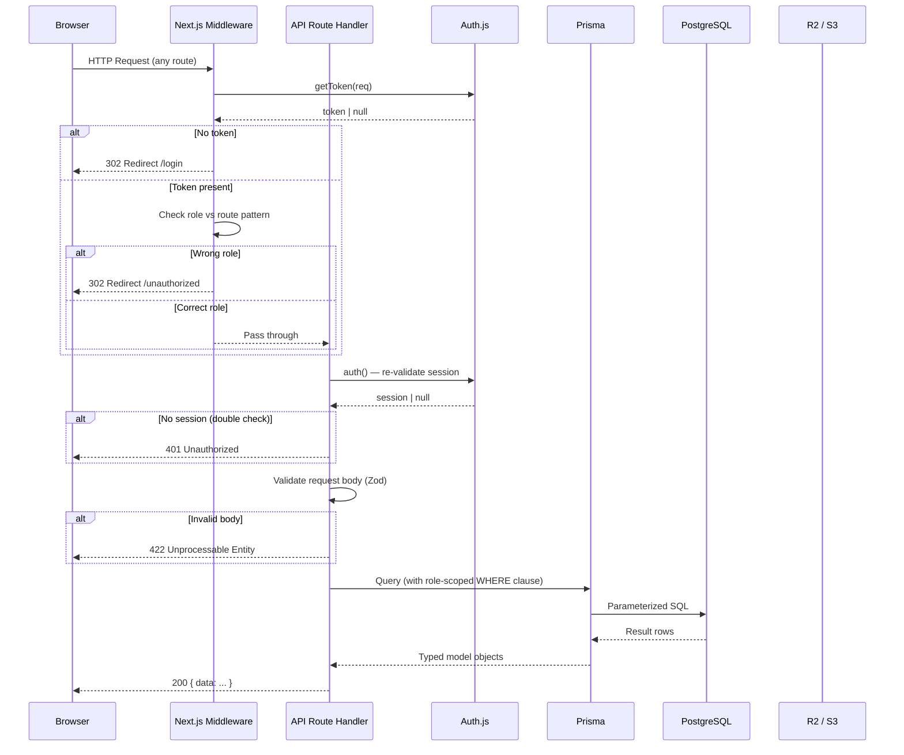
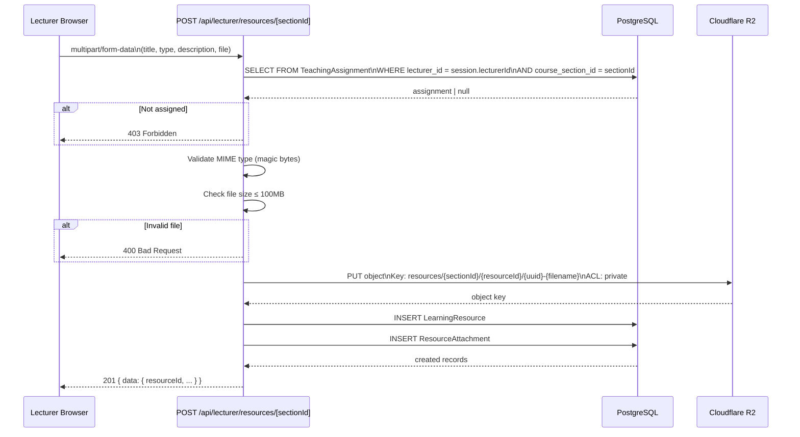
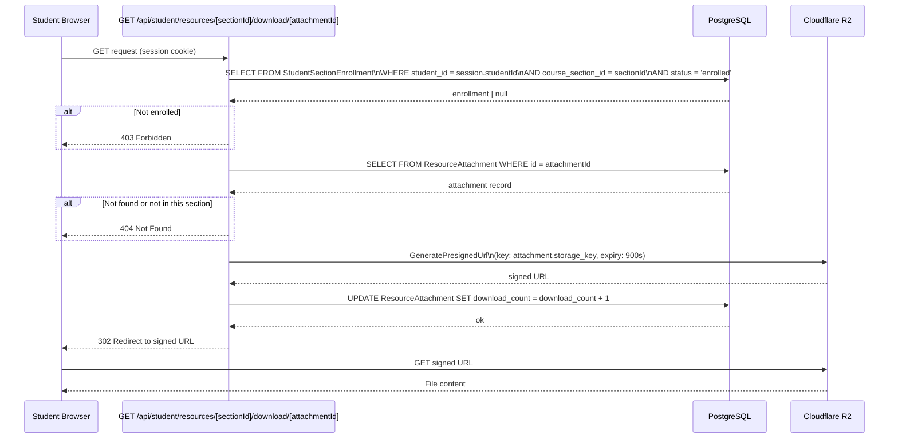
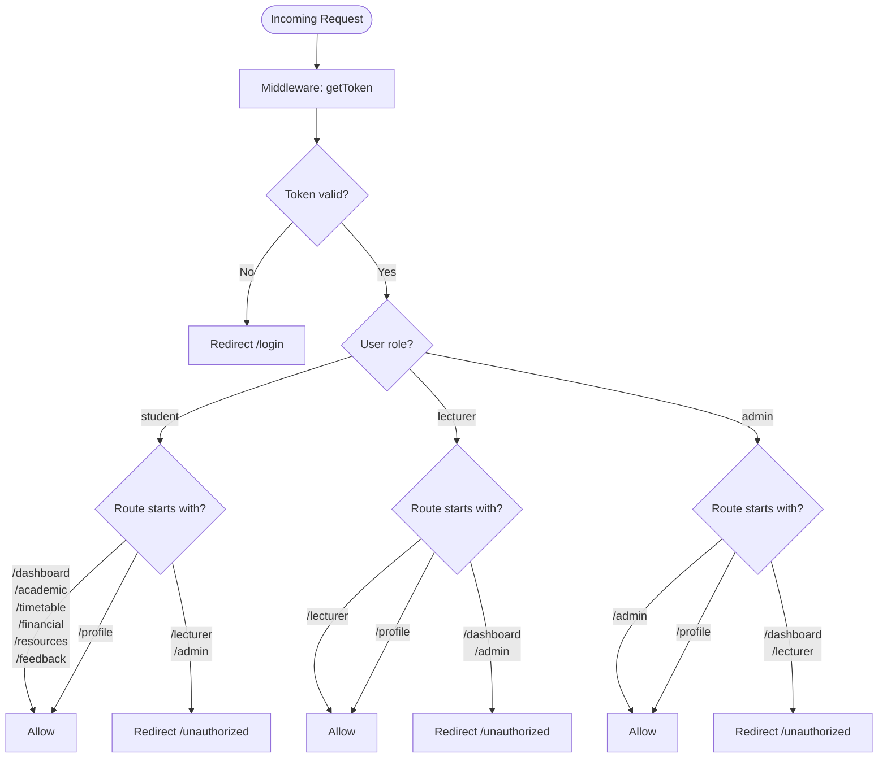

# Backend / API Flow

All flows below were validated by the graphify knowledge graph. The "Middleware & Session Guard" community (cohesion 0.67) and the "Security: Auth Hardening" community (cohesion 0.67) confirm that the auth and request lifecycle design is internally consistent.

---

## Request Lifecycle



---

## Resource Upload Flow (Lecturer)



---

## Resource Download Flow (Student)



---

## Auth Login Flow

```mermaid
sequenceDiagram
    participant Browser
    participant Login as /api/auth/[...nextauth]
    participant DB as PostgreSQL

    Browser->>Login: POST { username, password }
    Login->>DB: SELECT User WHERE username = $1 AND is_active = true
    DB-->>Login: user | null

    alt User not found
        Login-->>Browser: 401 { error: "Invalid credentials" }
    end

    Login->>Login: bcrypt.compare(password, user.password_hash)

    alt Password mismatch
        Login-->>Browser: 401 { error: "Invalid credentials" }
    end

    Login->>DB: INSERT Session { userId, token, expires }
    DB-->>Login: session

    Login-->>Browser: 200 Set-Cookie: session=<token>; HttpOnly; Secure; SameSite=Lax
    Browser->>Browser: Redirect to role-based dashboard
```

---

## Middleware Route Protection Map


