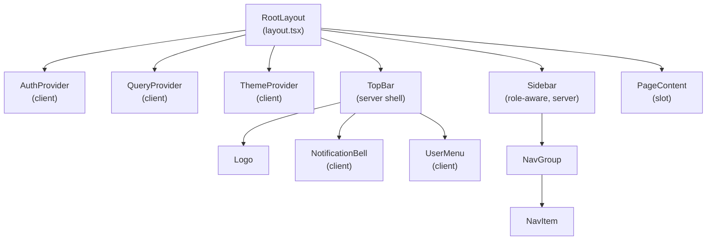
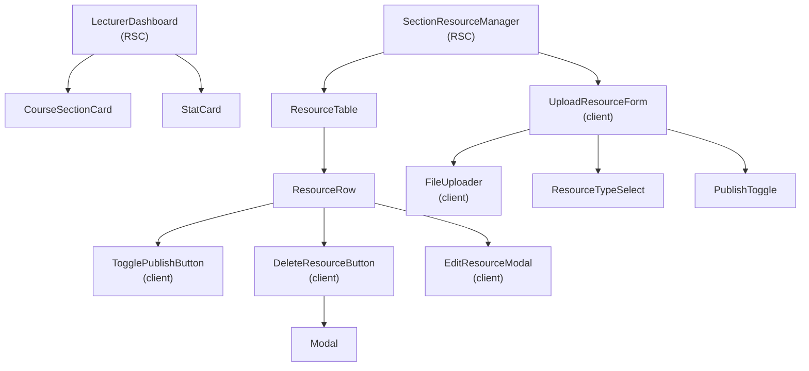
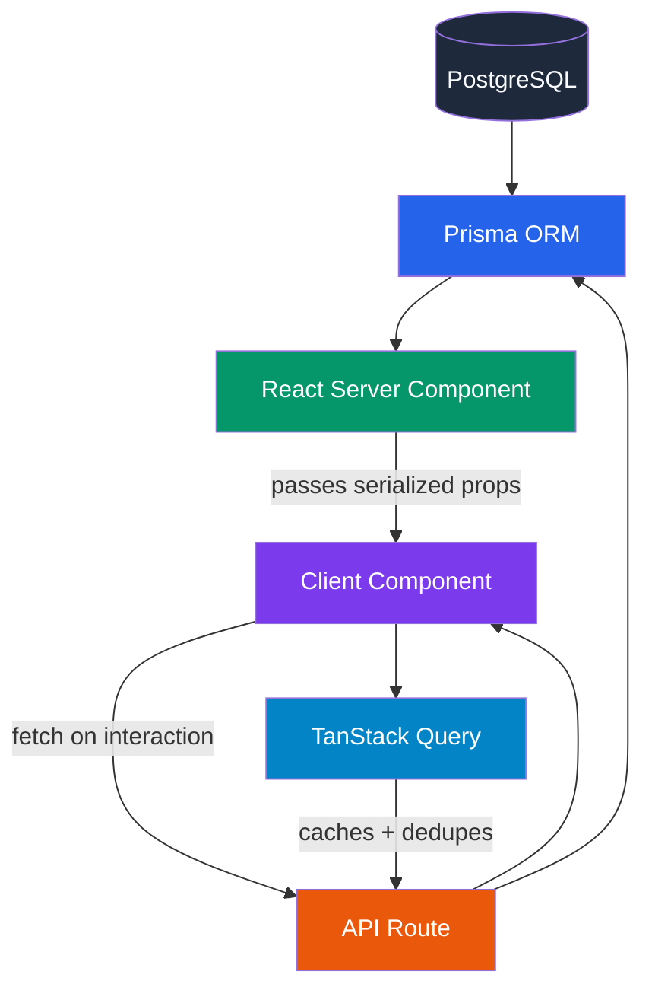

# Component Dependencies

> **Graphify note:** `AcademicPage` is a high-betweenness-centrality bridge node connecting three knowledge communities (Legacy Academic Page, Academic Records Schema, Programme Listing Schema). Keep its sub-components (`ProgrammeListingTable`, `SemesterTabs`, `ProgrammeStructureAccordion`) independently data-fetching rather than consolidating into one monolithic component.

---

## Overall Component Tree

---

## Student Pages → Components

```mermaid
graph TD
    StudentDash["DashboardPage\n(RSC)"]
    StudentDash --> StatCard
    StudentDash --> AlertBanner
    StudentDash --> AnnouncementFeed
    AnnouncementFeed --> AnnouncementCard
    StudentDash --> UpcomingClassWidget
    UpcomingClassWidget --> ClassScheduleItem
    StudentDash --> QuickActions

    AcademicPage["AcademicPage\n(RSC)"]
    AcademicPage --> ProgrammeListingTable
    AcademicPage --> SemesterTabs["SemesterTabs\n(client)"]
    SemesterTabs --> SemesterPanel
    SemesterPanel --> SemesterSummaryRow
    SemesterPanel --> CourseResultTable
    CourseResultTable --> CourseResultRow
    CourseResultRow --> Badge
    AcademicPage --> GPATrendChart["GPATrendChart\n(client)"]
    AcademicPage --> CreditProgressBar
    AcademicPage --> ProgrammeStructureAccordion
    ProgrammeStructureAccordion --> Accordion
    ProgrammeStructureAccordion --> CourseStructureRow

    TimetablePage["TimetablePage\n(RSC)"]
    TimetablePage --> SemesterSelector["SemesterSelector\n(client)"]
    TimetablePage --> ViewToggle["ViewToggle\n(client)"]
    TimetablePage --> WeeklyCalendar["WeeklyCalendar\n(client)"]
    WeeklyCalendar --> CalendarHeader
    WeeklyCalendar --> DayColumn
    DayColumn --> ClassBlock
    TimetablePage --> TimetableListView
    TimetableListView --> DateRangePicker["DateRangePicker\n(client)"]

    FinancialPage["FinancialPage\n(RSC)"]
    FinancialPage --> BalanceSummaryCards
    BalanceSummaryCards --> StatCard
    FinancialPage --> InvoiceTable["InvoiceTable\n(client)"]
    InvoiceTable --> InvoiceRow
    InvoiceRow --> Badge
    InvoiceRow --> InvoiceDetailModal["InvoiceDetailModal\n(client)"]
    FinancialPage --> PaymentHistoryTable
    FinancialPage --> PaymentTimelineChart["PaymentTimelineChart\n(client)"]

    ProfilePage["ProfilePage\n(RSC)"]
    ProfilePage --> ProfileSummaryCard
    ProfileSummaryCard --> Avatar
    ProfilePage --> ProfileCompletionBar
    ProfilePage --> PersonalInfoSection
    ProfilePage --> ContactInfoSection
    ProfilePage --> GuardianInfoSection
    ProfilePage --> AddressSection
    PersonalInfoSection --> InlineEditField["InlineEditField\n(client)"]

    ResourcesStudent["ResourcesPage — Student\n(RSC)"]
    ResourcesStudent --> CourseSectionList
    CourseSectionList --> CourseSectionCard
    ResourcesStudent --> ResourcesBySection
    ResourcesBySection --> ResourceTypeFilter["ResourceTypeFilter\n(client)"]
    ResourcesBySection --> ResourceGrid
    ResourceGrid --> ResourceCard
    ResourceCard --> ResourceDownloadButton["ResourceDownloadButton\n(client)"]

    FeedbackPage["FeedbackPage\n(RSC)"]
    FeedbackPage --> FeedbackList
    FeedbackList --> FeedbackCard
    FeedbackCard --> FeedbackStatusBadge
    FeedbackPage --> CreateFeedbackModal["CreateFeedbackModal\n(client)"]
```

---

## Lecturer Pages → Components

---

## Shared Component Dependencies

```mermaid
graph TD
    subgraph ui["ui/ (primitive layer)"]
        Button
        Input
        Textarea
        Select
        Badge
        Card
        Table
        Modal
        Tabs
        Accordion
        Avatar
        Skeleton
        EmptyState
        Toast
        FileUploader
        DatePicker
    end

    subgraph composite["Composite Components"]
        StatCard --> Card
        StatCard --> Badge
        AnnouncementCard --> Card
        ClassBlock --> Card
        ResourceCard --> Card
        ResourceCard --> Badge
        FeedbackCard --> Card
        FeedbackCard --> Badge
        InvoiceRow --> Badge
        CourseResultRow --> Badge
        InlineEditField --> Input
        InlineEditField --> Button
        CreateFeedbackModal --> Modal
        CreateFeedbackModal --> Input
        CreateFeedbackModal --> Textarea
        CreateFeedbackModal --> Button
        UploadResourceForm --> Input
        UploadResourceForm --> Textarea
        UploadResourceForm --> Select
        UploadResourceForm --> FileUploader
        UploadResourceForm --> Button
        SemesterTabs --> Tabs
        ProgrammeStructureAccordion --> Accordion
        InvoiceDetailModal --> Modal
    end
```

---

## Data Flow: Server → Client

