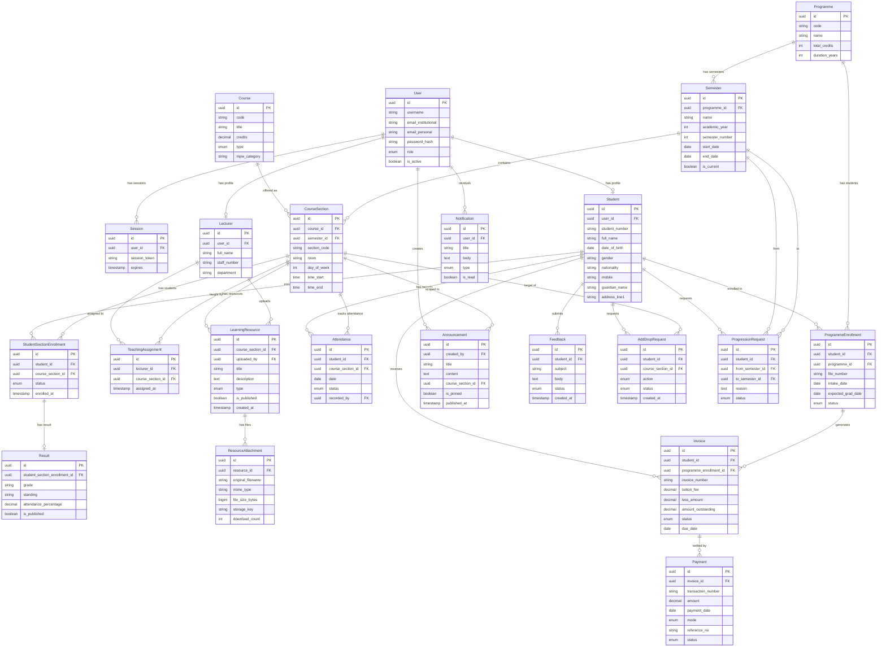

# Database Relationships

Access control for Learning Resources is enforced through two authorization tables:
- **`TeachingAssignment`** — grants a Lecturer the right to upload to a specific `CourseSection`
- **`StudentSectionEnrollment`** — grants a Student the right to view/download resources in a specific `CourseSection`

Both are confirmed as a unified access-control hyperedge by graphify (confidence 1.00). Never bypass them.

