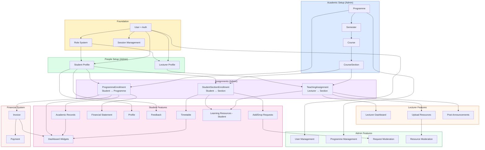
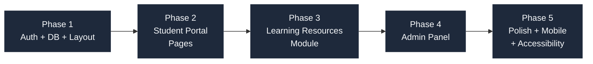
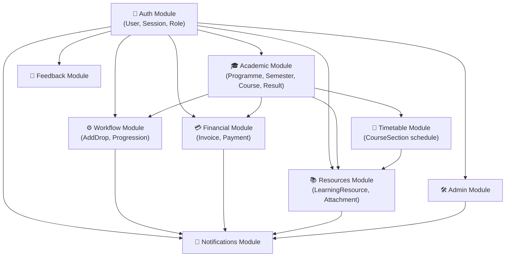

# Feature Dependencies

Shows which features depend on other features or data being set up first. Use this to determine build order.

> The graphify "Implementation Phases" community (cohesion 0.40) and "Feature Dependency Map" community (cohesion 0.20) confirm that the phase sequencing is logically consistent. The build order below is the authoritative delivery sequence.

---

## Build Order (Phase Sequence)

---

## Module Interdependencies

