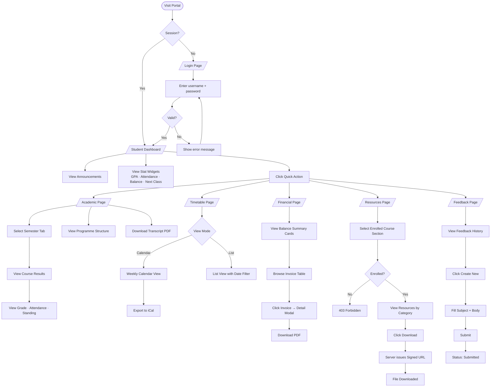
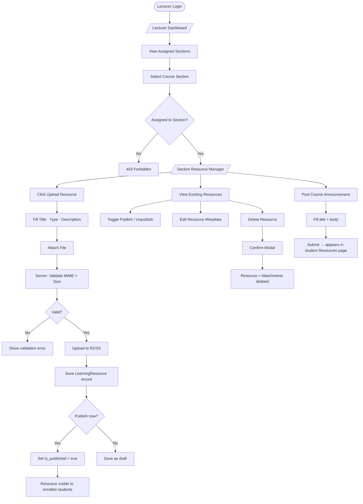
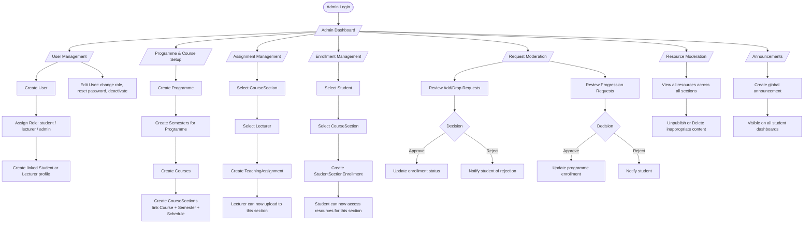

# User Flows — Mermaid Diagrams

> Graphify detected 11 dedicated user-flow communities (Student Dashboard Flow, Student Academic Flow, Student Timetable Flow, Student Financial Flow, Lecturer Login Flow, Lecturer Resource Upload Flow, etc.), confirming that each role's flows are distinct and non-overlapping. Admin flows form their own community cluster separate from student and lecturer.

---

## Student Flow

---

## Lecturer Flow

---

## Admin Flow

